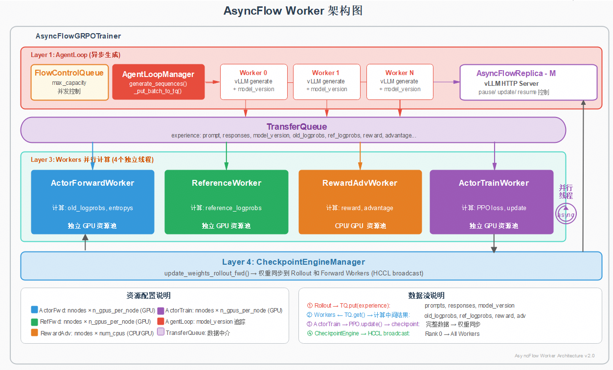

# AsyncFlow

AsyncFlow 是基于 verl 实现的 **训推异步流水线** 方案。通过 `TransferQueue (TQ)` 与 `CheckpointEngine (CE)` 将推理（Rollout）与训练（Trainer）解耦，配合 Staleness 机制与权重异步同步，可显著提升 RLHF/GRPO 训练吞吐。

- 详细架构与组件说明：[`docs/architecture.md`](./docs/architecture.md)
- 完整性能配置与精度数据：[`docs/performance.md`](./docs/performance.md)

## 1. 整体架构



- **AgentLoop Layer**：异步生成层（`AsyncFlowAgentLoopManager` + `AgentLoopWorker`），支持 `model_version` 追踪。
- **TransferQueue**：异步数据流中间件，解耦 Rollout 与下游 Workers。
- **四个独立 Workers**：`ActorForwardWorker`（old_log_probs / entropys）、`ReferenceForwardWorker`（ref_logprobs）、`RewardAdvWorker`（reward / advantage）、`ActorTrainWorker`（PPO loss + 参数更新）。
- **CheckpointEngine**：基于 HCCL 的异步权重广播。
- **FlowControlQueue**：Staleness 控制队列，限制 inflight 请求数。

## 2. 性能收益

> 详细配置见 [`docs/performance.md`](./docs/performance.md)。

| 性能指标 | Verl On-Policy | Async Flow | Fully Async |
| --- | --- | --- | --- |
| `prompt:2k → response:16k` 角色 | All | Rollout-Ref-Fwd-Trainer | Rollout-Train |
| Cluster NPU 切分 | 64 | 50-2-2-8 | 48-16 |
| `perf/throughput` | 59.3 | **226.8** | 149.66 |
| 相对提升 | / | **3.81×** | 2.52× |

精度方面，异步 RL 在 `staleness ≤ 2` 时可与同步 RL 对齐甚至微幅提升（详见性能文档）。

## 3. Quick Start

### 3.1 环境

- 参见 [`REQUIRED_VERL.txt`](./REQUIRED_VERL.txt) 与 [`requirements.txt`](./requirements.txt)
- 推荐 Ascend NPU 环境（HCCL CheckpointEngine）

### 3.2 单机示例（Qwen2.5-0.5B + GSM8K）

```bash
bash recipe/async_flow/run_async_grpo_qwen0.5b_gsm8k_local.sh
```

主要环境变量：

```bash
export ASCEND_RT_VISIBLE_DEVICES=0,1,2,3,4,5,6,7
export VLLM_USE_V1=1
export VERL_CLUSTER_TRACE=1
export PROMETHEUS_METRICS_ENABLE=true
export PROMETHEUS_METRICS_PORT=9400
export PROMETHEUS_MULTIPROC_DIR=/tmp/prom_metrics
```

入口模块：`recipe.async_flow.grpo_main`，复用 verl Hydra 配置体系，通过 CLI override 覆盖训练参数（`data.*`、`actor_rollout_ref.*`、`async_resources.*` 等）。

### 3.3 7B 示例

```bash
bash recipe/async_flow/run_async_grpo_qwen7b_gsm8k_local.sh
```

## 4. 目录结构

```
recipe/async_flow/
├── agent_loop/             # AsyncFlowAgentLoopManager / AgentLoopWorker
├── config/                 # Hydra 配置
├── docs/                   # 详细架构、性能文档
├── tests/                  # 单元 / 集成测试
├── utils/                  # TransferQueue、cluster_trace、metric 等工具
├── vllm_rollout/           # vLLM Rollout 接入
├── workers/                # 4 个独立 Worker 实现
├── async_flow_trainer.py   # 异步 Trainer 主控
├── config.py               # 配置 dataclass
├── grpo_main.py            # 训练入口
└── run_async_grpo_*.sh     # 启动脚本
```
