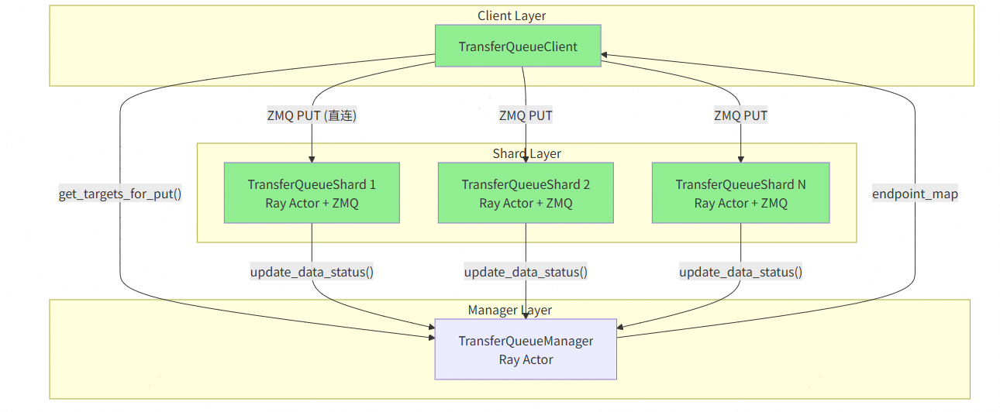
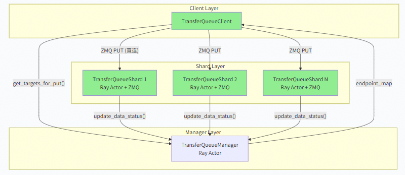
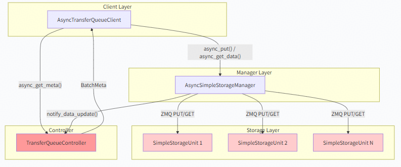
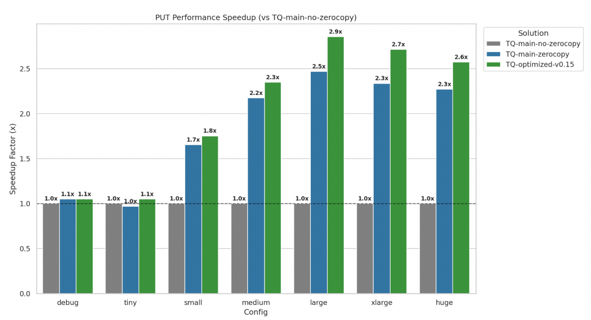
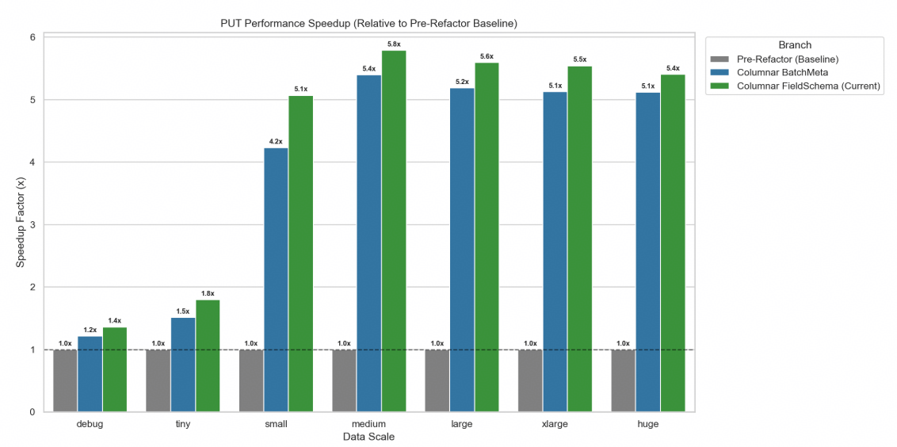
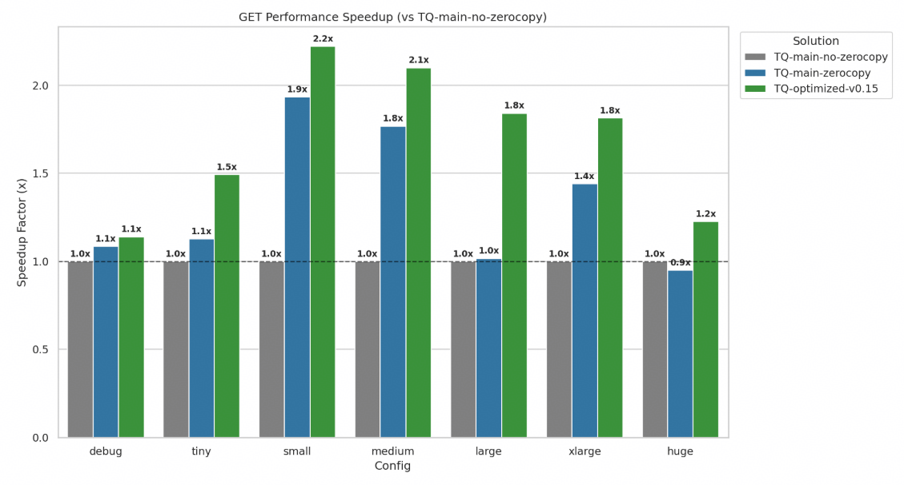
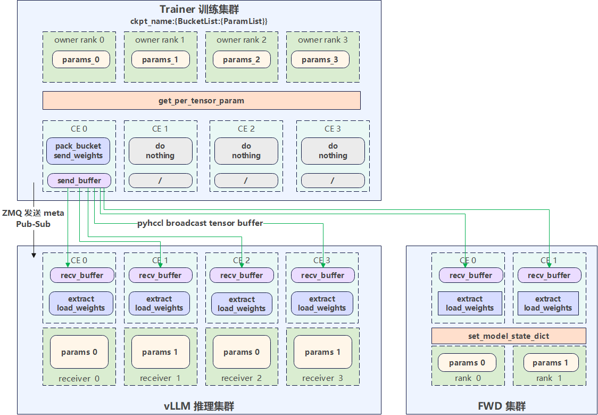
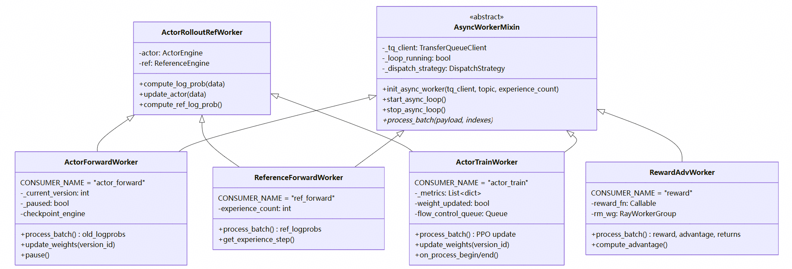
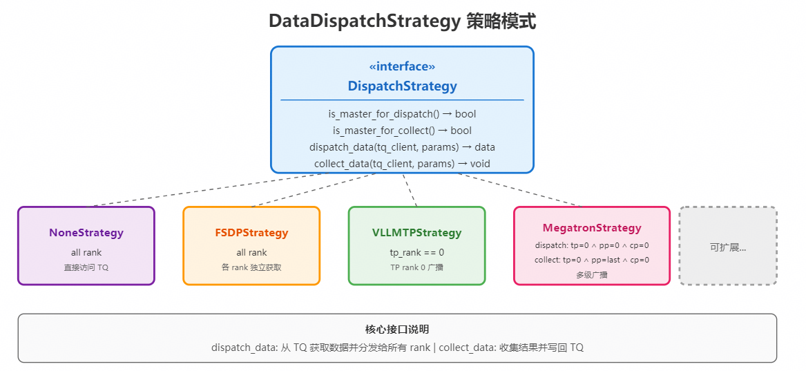
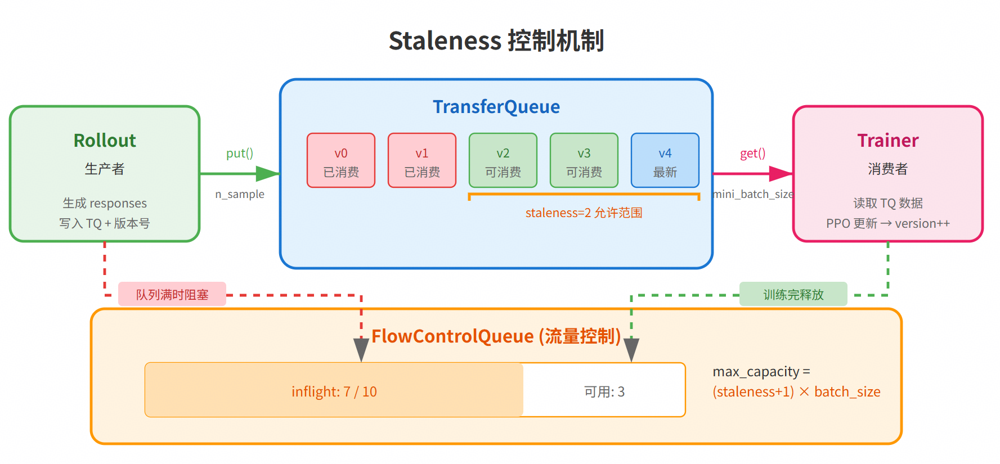

# AsyncFlow 架构与组件

> 本文是 AsyncFlow 详细架构说明。

## 1. 整体架构


**核心特点**

- **AgentLoop Layer**：异步生成层，包含 `AsyncFlowAgentLoopManager` 和多个 `AgentLoopWorker`，支持 `model_version` 追踪。
- **TransferQueue**：异步数据流中间件，解耦 Rollout 与下游 Workers。
- **四个独立 Workers**：
  - `ActorForwardWorker`：计算 `old_log_probs` 和 `entropys`
  - `ReferenceForwardWorker`：计算 `reference_logprobs`（KL 散度）
  - `RewardAdvWorker`：计算 `reward` 和 `advantage`（GRPO normalization）
  - `ActorTrainWorker`：执行 PPO loss 计算和参数更新
- **CheckpointEngine**：异步权重同步机制。
- **FlowControlQueue**：Staleness 控制队列。

## 2. TransferQueue_AsyncFlow

面向 AsyncFlow 定制的高速 **数据中枢**。采用 **控制面 + 数据面分离、分布式存储** 架构。



### 2.1 接口介绍

TQ_AsyncFlow 引入 **topic** 概念，类似消息队列主题，每个 topic 拥有独立 schema（数据列定义），用于业务隔离（如常规经验 vs 多模态）。

| 分类 | 接口 | 主要功能 | 社区版对应 |
| --- | --- | --- | --- |
| 主题管理 | `add_topic` | 注册主题并配置存储空间 | 无显式接口（`put` 自动建分区） |
|  | `delete_topic` | 删除指定主题及所有数据 | `clear_partition` / `async_clear_partition` |
| 数据写入 | `put_experience` | 同步写入（支持共享列分离） | `put` |
|  | `put_experience_async` | 异步写入 | `async_put` |
| 数据读取 | `get_experience` | 同步获取（支持采样和版本控制） | `get_data`（需先 `get_meta`） |
|  | `get_experience_async` | 异步获取 | `async_get_data` |
| 数据删除 | `delete_experience` | 删除指定经验数据 | `clear_samples` |
| 状态查询 | `get_data_ready_set` | 已就绪数据集合 | `get_production_status` |
|  | `get_data_consumed_set` | 已被消费的数据集合 | `get_consumption_status` |
|  | `get_data_usable_set` | 满足版本/过期度的可用数据集合 | 无对应 |

> 注：Topic 与社区 TQ 的 partition 不同。partition 是物理存储单元（类似数据库表分区），用于扩展存储上限；TQ_AsyncFlow 通过动态调整存储表大小实现存储扩展。

### 2.2 关键特性适配 AsyncFlow

1. **数据去重消除存储与通信冗余**：在 GRPO/GSPO 等算法中，针对"组"样本间存在大量重复数据（如 prompts）的特性，引入 **引用计数（Reference Counting）** 机制。同组共享数据在发送端仅传输一次、存储端仅保留一份副本，有效降低带宽负载并显著减少内存占用。
2. **动态扩缩容**：摒弃固定容量限制，采用 **索引严格递增 + 动态扩容** 策略，根据实际产出数据量自适应调整表空间，降低上层逻辑的管理复杂度；结合当前版本号与 staleness 阈值动态清理过期数据。
3. **简化跨版本混样逻辑**：将版本号设计为 **数据属性**，可快速过滤样本，避开复杂的子表维护成本，使跨版本数据在分布式系统中高效流转。
4. **上层索引管理透明化**：Rollout 节点通过 `put_experience(data, version)` 完成写入，索引由 TQ 自动分配并异步返回；消费节点通过 `get_experience(count)` 请求数据，由 TQ 根据可用性动态分发数据和索引。Worker 与全局进度完全 **解耦**。

### 2.3 性能优化

1. **元数据列式存储**：将原行式数据管理改为列式，复杂度由 O(B×F)^5 优化为 O(B×F)，节省小对象创建与 ZMQ 传输开销，大 batchsize 场景下提升明显。
2. **端到端零拷贝**：pickle 仅序列化 Tensor 元数据（Header），Tensor body 通过 Buffer Protocol + ZMQ Zero-copy send 直接读取，避免 Python 层内存复制。**序列化开销节省 95%+**，多模态等大 Tensor 场景下性能显著提升。
3. **多 Shard 异步流式发送**：单 client put 请求负载均衡到多 shard，并行发送数据，最大化利用带宽。
4. **数据去重**：引用计数机制，同组共享数据发送端仅传输一次、存储端仅保留一份副本。

### 2.4 与社区 TransferQueue 关系

这是为 AsyncFlow 定制的精简版 TQ，简化部分架构，让数据流转更直接、更易维护。

**架构对比**：相对社区现有 TQ 简化了 StorageManager 层对存储端的管理，各存储节点直接与客户端和控制面交互。

<p align="center">
  
  
</p>

**适配异步**：AsyncFlow 的核心之一是 staleness 机制允许 Trainer 使用稍旧版本数据，因此要求数据引擎支持跨版本采样。

- TQ_AsyncFlow 将 `version` 作为数据属性/标签（元数据），通过 `latest_version`（最新版本）与 `allowed_staleness`（允许的滞后深度）划定 **滑动窗口**，从而筛选出"足够新鲜"的样本。
- 社区现有 TQ 依赖 partition 机制进行跨版本采样，每个版本的数据放置在同 partition_id 的分区。社区 TQ 接口具有单 partition 约束，跨版本采样需要 **逐 partition** 调用 `scan_data_status` / `get_metadata` / `get_data`，相对复杂。

**性能优化效果展示**

- [PR7 — 零拷贝优化](https://gitcode.com/Ascend/TransferQueue/pull/7)：累计 1000+ LOC，单 Client 单机最大带宽由 4.x Gbps 提升至 12.x Gbps。

  

  

- [PR28 — 列式改造](https://gitcode.com/Ascend/TransferQueue/pull/28)、[PR29 — 列式改造](https://gitcode.com/Ascend/TransferQueue/pull/29)：累计 3000+ LOC，将社区原本的行式 BatchMeta 改造为列式 BatchMeta，混合 Tensor 下单 Client 单机带宽最高达到 28 Gbps。

  

  

## 3. CheckpointEngine

CheckpointEngine 是 verl 统一的抽象层，用于在各种训练后端和推理后端之间同步权重。提供三个统一 API：

- `send_weights`：从生成器获取 `named_tensor`，以 Stream 流式方式发送。
- `receive_weights`：返回张量 Generator，以 Stream 流式方式生成命名张量。
- `get_weights`：返回张量 Generator，用于每个推理实例从本地缓存（共享内存、磁盘）独立更新权重。

### 3.1 HCCL CheckpointEngine

```python
@CheckpointEngineRegistry.register("hccl")
class HCCLCheckpointEngine(CheckpointEngine):
    ...
```

**特性**

- 基于 HCCL 集合通信实现 **权重广播**。
- 使用 ZeroMQ PUB/SUB 模式传输 **张量元数据**。
- **双缓冲流水线**（Send/Recv Buffer）：发送和接收并行，实现流水线传输，充分利用通信带宽，隐藏传输延迟。
- 支持 **分桶传输**：减少通信次数，批量传输小张量，桶大小可配（`update_weights_bucket_megabytes`）。
- 当前实现下 vLLMRollout 直接持有 Engine，调用 `engine.model.load_weights()` 加载。



### 3.2 参数更新时机

在 `flow_control_queue` 被 Trainer 消费数据后（即 Trainer 训练了一个 mini_batch），主线程通过轮询 `actor_train_wg.get_current_version()` 检测训练版本更新；当 `train_version > model_version` 时触发权重同步（即 Trainer 训完一个 GBS 数据量）。

## 4. 数据流与并行抽象

### 4.1 AsyncWorkerMixin 循环

每个 Worker 在独立 daemon 线程中运行 asyncio 事件循环，通过 `DispatchStrategy` 抽象 FSDP / NONE 等并行策略。



### 4.2 DataDispatchStrategy

`data_dispatch_strategy.py` 通过策略模式实现：

1. **接口统一**：所有并行后端暴露相同的 dispatch / collect 接口。
2. **行为多态**：不同后端实现各自的数据分发与收集逻辑。
3. **可扩展**：易于添加新的并行后端支持。



## 5. FlowControlQueue

**目的**：允许 Trainer 使用"稍旧"版本的数据进行训练，提高流水线效率。Staleness 控制：通过 FlowControlQueue 限制 inflight 请求数。



**工作原理**

- `staleness` 参数控制最大允许的版本落后数：
  - `staleness=0`：严格版本同步，最大并发为 `batch_size`，退化为 on-policy。
  - `staleness=N`：允许 N 个版本陈旧，最大并发为 `(N+1) × batch_size`。
- `max_capacity = (staleness + 1) * batch_size` 定义最大 inflight 请求数。
- 队列满时，主循环阻塞等待。
