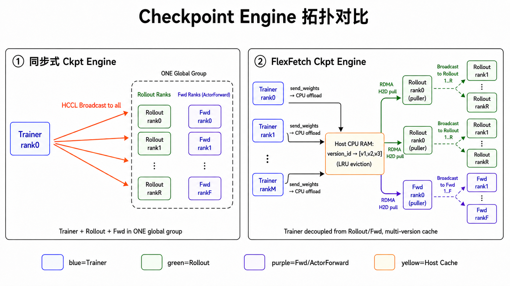
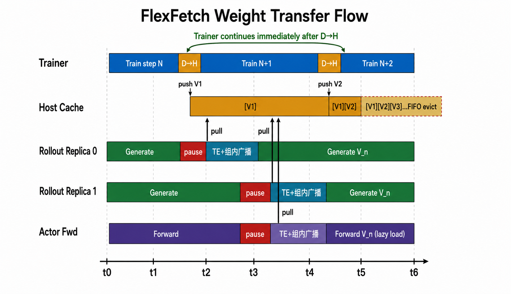

# Async Flow FlexFetch CheckpointEngine 设计文档

## 1. 背景

在全异步 RL（AsyncFlow）中，**Trainer**（FSDP / Megatron）与 **Rollout Replica**、**ActorForward / FWD** 运行在相互独立的进程组中，训练、采样和前向计算持续推进、互不阻塞。每完成若干训练步，Trainer 需要将最新策略权重同步给下游消费者，使在线采样和后续训练计算始终处于算法允许的 staleness 范围内。

这条权重更新链路主要面临三个问题：

- **跨进程组权重传输**：Trainer、Rollout Replica 与 ActorForward / FWD 运行在独立进程组中，不能依赖共享 NPU 内存直接传递权重，必须通过显式传输和热加载完成更新。
- **推理吞吐与 staleness 平衡**：同步式更新会暂停多个推理副本和 FWD 进程，减少有效推理时间；但推理侧也不能长期使用过旧权重，否则会超过算法允许的 staleness 范围。
- **多版本权重管理**：异步采样中，不同副本可能在 staleness 约束内使用不同权重版本。后续 logp、KL 等计算需要与样本生成时的策略版本对应，因此系统需要保留和追踪多个权重版本。

CheckpointEngine 抽象负责屏蔽权重搬运、版本管理和热加载细节。除 verl 标准的同步式权重更新路径外，AsyncFlow 进一步支持 **FlexFetch CheckpointEngine**：Trainer 侧将版本化权重写入 Host Cache，Rollout / FWD 侧在 staleness 约束内按需拉取指定版本，从而降低全局同步带来的停机成本。

---

## 2. FlexFetch 设计原则

以下原则描述的是 **FlexFetch CheckpointEngine** 的核心设计。它并不要求所有训练和推理进程在同一个时刻完成权重切换，而是将 Trainer 写入、版本驻留、Replica 拉取和组内加载拆成可独立推进的阶段。

### 原则一：支持多版本权重并发驻留

Host CPU RAM 中同时缓存最多 N 个版本（默认 3 个）的完整模型权重，以版本号为键索引，超出容量时按先进先出原则淘汰最早版本。

分配策略上，首个版本到来时一次性分配容纳全部版本所需的大块连续缓冲区，后续各版本按版本号取模映射到对应切片，并满足 Mooncake TransferEngine 对可访问内存区域的注册与对齐要求。

这是其他所有特性的基础：

- Trainer 写入新版本后无需等待任何一个 Replica 加载完成，直接继续训练。
- 同一时刻不同 Replica 可以持有 staleness 约束内的不同版本权重。
- 训练写入速度快于推理侧消费速度时，多个可用版本能够在缓存中短暂并存，避免系统被单一最新版本语义绑死。

### 原则二：权重高性能分布式任意时刻拉取

FlexFetch 并不是维护多个权重来源，而是将同一个权重版本的不同 shard 分布式缓存在多个 Trainer 节点上。每个 Rollout Replica 或 FWD Replica 可以独立决定**何时拉取**、**从哪些 Trainer shard 拉取**、**拉取哪个版本**：

- **分布式 shard 缓存**：权重按 Trainer rank 数切分到各 shard 的 CPU 缓存中。Replica 持有所有 Trainer shard 的地址信息，可向多个 shard 并发发起高性能读取，充分利用多机带宽并避免单点瓶颈。
- **任意时刻拉取**：Trainer 只需把权重写入 Host Cache 并对外暴露查询信息，之后 Replica 可在自己的更新窗口内按需拉取，无需与 Trainer 保持同步栅栏。
- **任意版本拉取**：Replica 可以指定任意仍在缓存中的版本进行拉取，不同 Replica 可同时持有 staleness 约束内的不同权重版本。

### 原则三：两阶段传输，训练写入与推理/FWD 更新解耦

权重同步拆成两个独立阶段：

**阶段一：D→H（Trainer 写入 Host Cache）**

Trainer 遍历所有 tensor，按 Trainer rank 数将参数均分打包成多个固定大小的 Bucket（默认 512 MB）。每个 rank 将自己负责的 Bucket 转为 bfloat16 后写入 Host Cache 的对应版本切片，并记录每个 layer 的形状、数据类型和偏移量。首个版本写入时统一注册所有 Bucket 的内存区域，后续版本复用同一注册。写完即可继续训练，**阶段一结束是 Trainer 与下游权重加载流程的解耦点**。

**阶段二：H→D（Replica 按需拉取并加载）**

各 Replica 的主节点顺序遍历所有 Trainer shard：通过查询服务获取指定版本各 Bucket 的内存访问信息，再通过 Mooncake TransferEngine 将 Bucket 数据拉到本地缓冲区。每个 Bucket 拉完后，主节点向组内广播 Bucket 的 tensor 描述信息，随后通过组内集合通信将数据分发给其余 rank；各 rank 按描述信息切分重建 tensor 后热加载到推理引擎。整个阶段不涉及 Trainer 训练进程，各 Replica 完全并行。

### 原则四：缩小同步范围

同步式权重更新通常需要将 Trainer、Rollout 和 FWD 纳入同一次权重切换流程，等待所有相关进程进入更新窗口后再完成广播与加载。FlexFetch 将同步范围拆小：

- Trainer 各 shard 各自维护 Host Cache，仅对外提供版本查询与内存访问信息，不参与 Replica 侧集合通信。
- 每个 Rollout Replica 内部建立小型通信组（主节点 + 其他 rank），仅用于组内元数据和权重数据广播。
- FWD group 同理，独立完成暂停、拉取和加载。

因此，集合通信只发生在单个 Replica 或 FWD group 内部，权重更新不再要求所有 Rollout Replica 与 FWD 同时进入同一个全局同步点。

---

## 3. 系统架构

### 3.1 同步式 CKPT Engine vs FlexFetch CKPT Engine

下图展示了两种权重更新方式的整体差异：左侧同步式 CKPT Engine 将 Trainer、Rollout 和 FWD 纳入同一次同步更新流程，由训练侧通过集合通信广播权重；右侧 FlexFetch CKPT Engine 中，Trainer 只负责将版本化权重写入 Host Cache 并提供查询信息，各 Replica 独立建立组内通信，通过 Mooncake TransferEngine 从 Trainer Host Cache 拉取权重。

| 维度         | 同步式 CKPT Engine                        | FlexFetch CKPT Engine                        |
| ---------- | -------------------------------------- | -------------------------------------------- |
| 同步范围       | Trainer + 全部 Rollout + FWD 进入同一次同步更新流程 | Trainer 写入后退出更新链路；各 Replica / FWD group 独立更新 |
| 多版本支持      | 一次同步覆盖当前权重，不保留历史版本                     | Host Cache 保留最近 N 个版本，默认 3 个，FIFO 淘汰         |
| 更新时机       | 所有相关进程必须同时进入更新窗口                       | Replica 可在自己的更新窗口内按需拉取                       |
| 版本选择       | 只切换到本次同步广播的版本                          | Replica 可指定任意仍在缓存中的版本                        |
| Trainer 等待 | 需要等待同步广播与加载流程完成                        | 写入 Host Cache 后即可继续训练                        |
| 停机窗口       | 集中，多个副本同步暂停与恢复                         | 分散，各 Replica 独立短暂停机                          |
| 实现组成       | 集合通信广播与统一加载                            | 查询服务 + Mooncake TransferEngine + 组内广播        |

**定位说明**：

- 同步式 CKPT Engine 对应 verl 标准权重更新路径，适用于规模较小、可以接受全局同步暂停的场景。
- FlexFetch CKPT Engine 是面向 AsyncFlow 异步训练的扩展路径，重点解决训练写入与推理更新解耦、多版本 staleness 管理和大规模副本并发更新问题。

### 3.2 分层架构

整体架构分为两层：

**上层：AsyncFlowCheckpointEngineManager（调度层）**

Manager 在独立的后台异步事件循环线程中运行，负责跨进程组的并发调度。两种更新路径的执行流程不同：

*同步式 CKPT Engine*：

1. 暂停 FWD 进程。
2. 暂停全部 Rollout Replica，等待所有在途请求完成。
3. 所有 Trainer / Rollout / FWD worker 交换进程组元数据。
4. 建立跨越 Trainer、Rollout、FWD 的同步通信组。
5. 阻塞广播权重，所有方同步完成加载。
6. 完成收尾后恢复所有 Replica。

*FlexFetch CKPT Engine*：

1. 启动 Trainer 侧权重地址查询服务（后台线程）。
2. 阻塞等待 Trainer 将权重写入 Host Cache（D→H）完成。
3. 并发提交各 Replica 的更新任务：每个 Rollout Replica 独立执行暂停、建立组内通信、拉取权重、收尾、恢复；FWD group 同步执行暂停、建立组内通信、拉取权重、收尾（FWD 无需恢复）。
4. Trainer 侧清理查询服务。

各 Replica 与 FWD 之间完全并行，互不等待。

**下层：CheckpointEngine 抽象接口（传输层）**

Manager 通过统一抽象接口与具体传输实现解耦。同步式路径保留 verl 标准权重更新语义，FlexFetch 则在同一抽象下扩展版本化 Host Cache 与按需拉取能力：

- **同步式 CheckpointEngine**：基于集合通信完成全局广播，实现简单，适合拓扑固定、副本数少、同步暂停成本可接受的场景。
- **FlexFetchCheckpointEngine**：由查询服务、Mooncake TransferEngine 和组内广播三个模块组合而成，支持多版本并发驻留与任意时刻按需拉取。

---

## 4. FlexFetch 权重传输流程

### 4.1 示意图

下图以时间轴（t0→t6）展示了一次完整的 FlexFetch 权重传输过程，纵向列出 Trainer、Host Cache、Rollout Replica 0/1 和 Actor Fwd 五个角色。Trainer 完成 D→H 写入后立即继续训练，各 Replica 在各自节奏下独立暂停、通过高性能传输拉取并组内广播权重后恢复生成，Trainer 与各 Replica 之间无直接同步点。

### 4.2 传输过程说明

**Trainer 侧（D→H）**

Trainer 遍历所有 tensor，按 Trainer rank 数将参数均分打包成多个固定大小的 Bucket。每个 rank 将自己负责的 Bucket 转为 bfloat16 后写入 Host Cache 的版本化切片，并记录每个 layer 的形状、数据类型和偏移量。首个版本写入时统一注册所有 Bucket 的内存区域，后续版本复用同一注册。写完即继续训练，不感知任何 Replica 状态。

**Replica 侧（H→D）**

各 Replica 的主节点顺序遍历所有 Trainer shard，执行以下步骤：

1. **地址查询**：向 Trainer shard 的查询服务发送目标版本号，收到该 shard 所有 Bucket 的内存访问信息。
2. **高性能拉取**：通过 Mooncake TransferEngine 将每个 Bucket 写入本地 NPU Pinned Buffer。
3. **元数据广播**：主节点向组内成员广播当前 Bucket 的 tensor 描述信息（名称、形状、数据类型、偏移量）。
4. **数据广播**：主节点将缓冲区数据通过组内集合通信分发给其余 rank，各 rank 按描述信息切分重建 tensor 后热加载到推理引擎。

步骤 2→3→4 对每个 Bucket 依次执行（先广播元数据，再广播 tensor 数据）。不同 Replica 之间完全并行，可同时持有 staleness 约束内的不同版本权重。

---

## 5. 总结

FlexFetch CheckpointEngine 的核心设计用三个关键词概括：

**多版本**：Host Cache 同时驻留多个版本权重（默认 3 个，超出后 FIFO 淘汰），Trainer 不等推理，推理不强求同步到单一最新版本，双方以各自节奏运行。

**按需拉取**：每个 Replica 可在任意时刻、向多个 Trainer shard 并发拉取任意仍在缓存中的版本，无全局同步栅栏，系统天然支持大规模副本并发更新与不同 staleness 策略。

**范围解耦**：Trainer 写入 Host Cache 后即可继续训练；Rollout Replica 与 FWD group 分别在自己的更新窗口内完成拉取和组内加载，避免所有训练、推理和 FWD 进程被绑定到同一个全局同步点。

---

## 6. 展望

当前 FlexFetch 实现在 Host Cache 的内存管理上采用静态预分配策略：首个版本到来时一次性分配容纳全部版本所需的连续缓冲区，并注册为 Mooncake TransferEngine 可访问的内存区域。该策略实现简单、访问路径稳定，适合作为当前版本的默认方案。

后续可围绕超节点构建 Host Cache 内存池，将同一超节点内多台 Trainer 机器的可用 Host Cache 统一管理。这样可以提升拉取链路的亲和性，降低跨节点访问带来的时延，同时用更大的池化容量保存更多历史版本，为更高 staleness 容忍度和更大规模副本并发更新提供空间。
