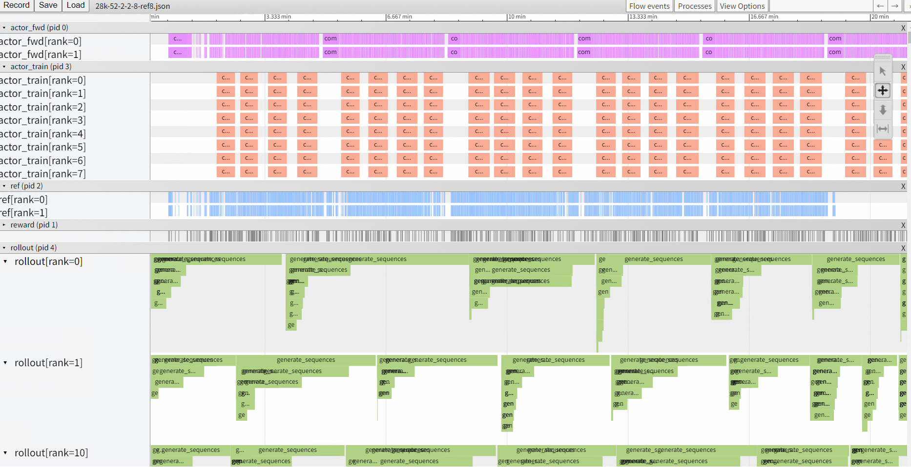
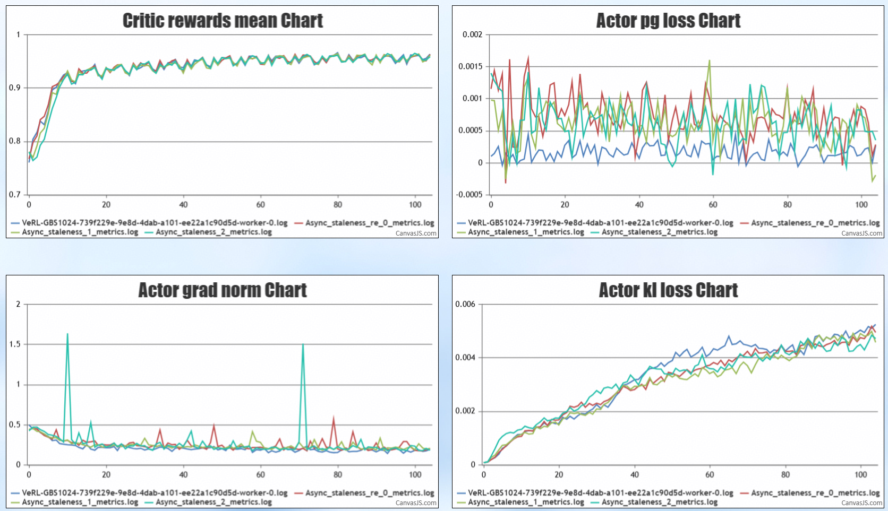

# AsyncFlow 性能与精度数据

> 实验详细配置与精度数据见此文。

## 1. 实验配置

**基础配置**：`Qwen2.5-Math-7B + DAPO-17k`

| 配置项 | 值 |
| --- | --- |
| `train_batch_size` | 128 |
| `ppo_mini_batch_size` | 32 |
| `n_samples` | 16 |
| `max_prompts` | 2k |
| `max_responses` | 16k |
| `average_responses` | 1k |
| `TP` | 2 |
| `use_remove_padding` | TRUE |
| `use_dynamic_bsz` | TRUE |
| `enforce_eager` | FALSE |
| `free_cache_engine` | TRUE |

**差异配置**

| 配置项 | Verl On-Policy | Async Flow | Fully Async |
| --- | --- | --- | --- |
| `num_workers` | 8 | 256 | 8 |
| `ref_experience_count` | / | 8 | / |
| `fwd_experience_count` | / | 8 | / |
| `reward_experience_count` | / | 16 | / |
| `staleness` | 0 | 5 | 0.5（`param_sync_step=4`） |
| `partial_rollout` | False | TRUE | TRUE |
| `only_forward` | / | TRUE | / |

## 2. Staleness 语义说明

在 AsyncFlow 中，`staleness` 同时定义了 **数据超发量** 和 **rollout 版本与 trainer 版本的最大允许差**，参数同步时机与 verl 原生一致（每个 GBS 训完触发）。

而 fully_async 由于额外引入 `require_batches` 与 `param_sync_step`，其 `staleness` 仅定义数据超发量，而训推版本差则间接通过 `require_batches`、`param_sync_step` 以及 `GBS / mini_bs` 比例控制。

与 fully_async best-practice 配置对齐示例：

```text
# fully_async
GBS: 512, mini_bs: 32, require_batches: 4, param_sync_step: 4, staleness_threshold: 0.5
# 含义：数据超发量 = 512 × 1.5，每 4 个 mini_batch 同步一次参数

# 等价 async_flow
GBS: 128, mini_bs: 32, staleness: 5
# 含义：数据超发量 = 128 × (5+1)，每 4 (= 128/32) 个 mini_batch 同步一次参数
```

## 3. 性能结论

| 性能指标 | Verl On-Policy | Async Flow | Fully Async |
| --- | --- | --- | --- |
| `prompt:2k → response:16k` | All | Rollout-Ref-Fwd-Trainer | Rollout-Train |
| Cluster NPU 切分 | 64 | 50-2-2-8 | 48-16 |
| `perf/throughput` | 59.3 | **226.8** | 149.66 |
| 相对提升 | / | **3.81×** | 2.52× |

**Trace 分析**



## 4. 精度数据

### 4.1 reward 曲线



### 4.2 评测数据

| Benchmark | 同步 RL | 异步 RL `staleness=0` | `staleness=1` | `staleness=2` | `staleness=4` |
| --- | --- | --- | --- | --- | --- |
| gsm8k | 90.98 | 91.89 | 90.98 | 92.42 | 91.28 |
| MATH 500 | 44.60 | 45.20 | 46.00 | 47.20 | 43.00 |

### 4.3 结论

1. 基模相比 RL 的评测指标有所提升，证明当前 **RL 配置整体策略与框架** 在提升数学推理能力上的有效性。
2. **同步 RL vs 异步 RL（`staleness=0`）**：两者准确率得分基本一致（差异 2% 以内），异步架构在无延迟状态下基本还原了同步架构的收敛精度。
3. **不同陈旧度（Staleness）对精度的影响**：适度的异步（`staleness ≤ 2`）能维持甚至微幅提升精度，但过高的延迟（`staleness=4`）可能导致部分数据衰退，存在 staleness 配置的 **甜点区**。
