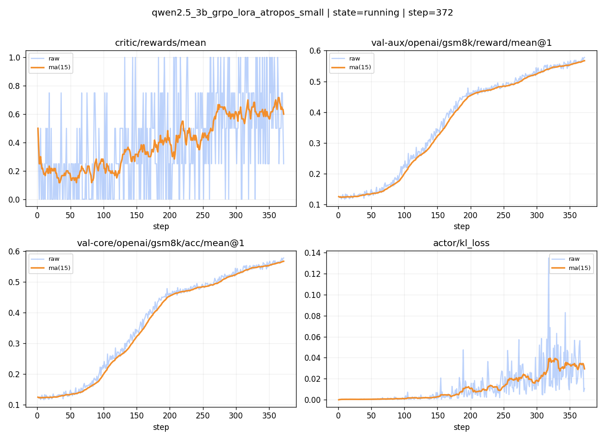

# Atropos-VERL Integration (GRPO)



- `val-aux/openai/gsm8k/reward/mean@1` and `val-core/openai/gsm8k/acc/mean@1`
  show a steady rise across training steps.
- `critic/rewards/mean` trends upward with expected noise for GSM8K.
- Stability metrics (KL, entropy, grad norm) remain bounded.

Focused **GRPO integration** between Atropos environments and VERL:
- **GRPO training** with optional **token-level advantage overrides** from Atropos.
- **VERL-managed inference servers** (vLLM) with endpoint registration.
- A **working GSM8K example** that improves task metrics.

Note: GRPO here is implemented via VERL’s PPO trainer scaffold with
`adv_estimator: grpo` and critic disabled. This is the canonical VERL GRPO path.

## Dataset used

Training and validation for the example run use GSM8K parquet files:

- Train: `/root/data/gsm8k/train_chat.parquet`
- Val: `/root/data/gsm8k/test_chat.parquet`

Adjust paths in `recipe/atropos/config/atropos_grpo_small.yaml` if your data lives elsewhere.
Source dataset: Hugging Face `openai/gsm8k` (config `main`), converted to parquet. You can reproduce
the standard parquet files with:

```bash
python examples/data_preprocess/gsm8k.py --local_save_dir ~/data/gsm8k
```

Dataset link: https://huggingface.co/datasets/openai/gsm8k

The run shown here uses a chat-formatted parquet variant derived from the same source.

## Example run (W&B)

Run link (shows steady reward and accuracy improvements on GSM8K):
`https://wandb.ai/vyomakesh018-prime-intellect/verl_grpo_example_gsm8k/runs/bp9qk39x?nw=nwuservyomakesh018`

## Key Components

- `atropos_integration.py`: Atropos API client + advantage override logic
- `grpo_atropos_trainer.py`: GRPO trainer with Atropos token-level advantages
- `launch_atropos_verl_services.py`: Orchestrates Atropos API, vLLM, and training
- `config/atropos_grpo_small.yaml`: Minimal GRPO config used by the launcher

## Run Commands

### Launch services + training (recommended)

```bash
cd verl
python recipe/atropos/launch_atropos_verl_services.py \
  --config recipe/atropos/config/atropos_grpo_small.yaml

# You can pass standard VeRL overrides after `--`:
python recipe/atropos/launch_atropos_verl_services.py \
  --config recipe/atropos/config/atropos_grpo_small.yaml -- \
  trainer.total_epochs=1 data.train_batch_size=2 actor_rollout_ref.rollout.n=2
```

This starts:
- Atropos API server
- vLLM inference server
- GRPO training via `RayGRPOAtroposTrainer`

## Example shell entrypoint

Use the included script to expose common VeRL configurables in one place:

```bash
bash recipe/atropos/run_qwen2_5-3b_gsm8k_grpo_lora_atropos.sh
```

## Config parity quick map

Overrides in the shell script map directly to Hydra keys:

| Script override | Hydra key |
| --- | --- |
| `data.train_files=...` | `data.train_files` |
| `data.val_files=...` | `data.val_files` |
| `data.train_batch_size=...` | `data.train_batch_size` |
| `data.max_prompt_length=...` | `data.max_prompt_length` |
| `data.max_response_length=...` | `data.max_response_length` |
| `actor_rollout_ref.model.path=...` | `actor_rollout_ref.model.path` |
| `actor_rollout_ref.model.lora_rank=...` | `actor_rollout_ref.model.lora_rank` |
| `actor_rollout_ref.model.lora_alpha=...` | `actor_rollout_ref.model.lora_alpha` |
| `actor_rollout_ref.actor.optim.lr=...` | `actor_rollout_ref.actor.optim.lr` |
| `actor_rollout_ref.rollout.n=...` | `actor_rollout_ref.rollout.n` |
| `actor_rollout_ref.rollout.gpu_memory_utilization=...` | `actor_rollout_ref.rollout.gpu_memory_utilization` |
| `trainer.project_name=...` | `trainer.project_name` |
| `trainer.experiment_name=...` | `trainer.experiment_name` |
| `trainer.atropos.api_url=...` | `trainer.atropos.api_url` |
| `trainer.atropos.environment=...` | `trainer.atropos.environment` |
| `inference.port=...` | `inference.port` |
| `inference.gpu_memory_utilization=...` | `inference.gpu_memory_utilization` |
