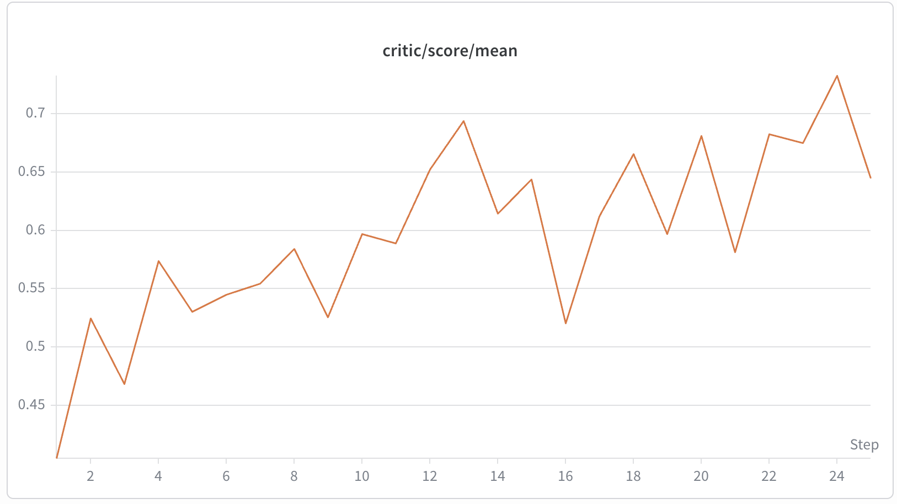
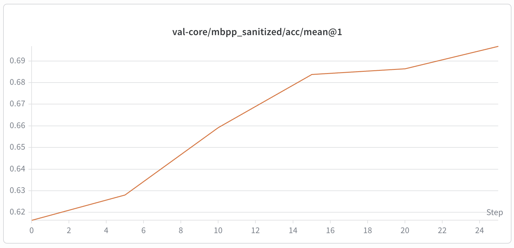

# MBPP Code Generation

## Introduction

This recipe demonstrates **RLVR (RL with Verifiable Rewards)** for Python code generation on the [MBPP (sanitized)](https://huggingface.co/datasets/google-research-datasets/mbpp) benchmark. It takes an instruction-tuned model ([Qwen/Qwen2.5-1.5B-Instruct](https://huggingface.co/Qwen/Qwen2.5-1.5B-Instruct)) and improves it using GRPO with rewards based on test execution. 

- **Hardware:** Validated on a single NVIDIA A100 40GB. We used Qwen2.5-1.5B-Instruct which has a peak memory requirement of 38.5GB during training.
- **Training time:** ~45 minutes for 25 epochs on NVIDIA A100 40GB.

<p align="center">
  
  
  <br>
  <em>Figure 1: Training (left) and Validation (right) reward across 25 epochs of GRPO training.</em>
</p>

## Dataset and training task

We used the [MBPP (sanitized)](https://huggingface.co/datasets/google-research-datasets/mbpp) benchmark dataset, which contains 420 python code generation tasks (120 for training, 257 for test, and 43 for validation) with natural-language task descriptions and, more importantly, **test cases for objective evaluation of any solution**. 
An example of one row from the dataset:

- **`text`**: `"Write a function to find the longest chain which can be formed from the given set of pairs."`
- **`task_id`**: `"123456"`
- **`test_list`**:
  ```json
  [
      "assert max_chain_length([Pair(5, 24), Pair(15, 25), Pair(27, 40), Pair(50, 60)], 4) == 3",
      "assert max_chain_length([Pair(1, 2), Pair(3, 4), Pair(5, 6), Pair(7, 8)], 4) == 4",
      "assert max_chain_length([Pair(19, 10), Pair(11, 12), Pair(13, 14), Pair(15, 16), Pair(31, 54)], 5) == 5"
  ]
  ```
- **`code`** (solution):
  ```python
  class Pair(object):
      def __init__(self, a, b):
          self.a = a
          self.b = b
  
  def max_chain_length(arr, n):
      max_val = 0
      mcl = [1 for i in range(n)]
      for i in range(1, n):
          for j in range(0, i):
              if (arr[i].a > arr[j].b and mcl[i] < mcl[j] + 1):
                  mcl[i] = mcl[j] + 1
      for i in range(n):
          if (max_val < mcl[i]):
              max_val = mcl[i]
      return max_val
  ```

The task is to generate a Python function that passes the given test cases. To train the model using `verl`, we use the `text` value as the prompt and add formatting instructions to it. This makes sure that the generated text is in the correct format for the reward function to extract the code and execute it. Here is the `verl` prompt constructed for the above example:

```
Write a function to find the longest chain which can be formed from the given set of pairs.

Your implementation should pass tests like the following (more tests will be used for evaluation):

`python
assert max_chain_length([Pair(5, 24), Pair(15, 25), Pair(27, 40), Pair(50, 60)], 4) == 3
`

Write your complete solution in a single markdown fenced code block using the language tag `python (open with ```python on its own line, close with `).
```

The code for generating the entire verl-compatible RL parquet files for training and validation is in the `create_mbpp_dataset.py` script.

## Reward Function

 The reward function is a verl-compatible reward function that takes the generated code and the test cases as input and returns the reward. The reward is the fraction of test cases that pass using the generated solution. If all the test cases pass, the reward is 1.0. If none of the test cases pass, for any reason, the reward is 0.0. The reward function is defined in the `reward_function.py` script.

To make sure that the generated code does not compromise the training process or the entire system, we use a sandboxed environment to execute the model generated code. The sandboxed environment is created using the `mbpp_exec_isolated.py` script using an independent process and a timeout of 10 seconds. If the code takes longer than 10 seconds to execute, the process is terminated and the reward is 0.0.

## Results

After 25 epochs of GRPO training:

| Stage | Average Test-Pass Rate on `test` set |
|-------|----------------------------|
| Qwen2.5-1.5B-Instruct (baseline) | 61.6% |
| After GRPO (25 epochs) | **69.7%** |

Refer to Figure 1 for the training and validation reward curves across 25 epochs of GRPO training.

## Running the recipe

### 1. Prepare Data

```bash
python3 recipe/mbpp_code_gen_grpo/create_mbpp_dataset.py --data_path ./data
```

This downloads MBPP (sanitized) from Hugging Face and creates RL parquet files under `./data/mbpp/rl/`. The `train` split (120 examples) is used for training and the `test` split (257 examples) is used for validation during training. The official MBPP `validation` split (43 examples) is skipped by default as it is too small for reliable evaluation.

### 2. GRPO Training

```bash
bash recipe/mbpp_code_gen_grpo/train_grpo.sh
```

GRPO config lives in `recipe/mbpp_code_gen_grpo/config/grpo.yaml`. `train_grpo.sh` resolves the recipe directory from the script location (like overriding paths in `recipe/mbpp_code_gen_grpo/train_grpo.sh`), so renaming the recipe folder does not require editing paths inside the YAML.

Training logs to Weights & Biases (W&B) under project `mbpp-code-gen-grpo`. Set `WANDB_API_KEY` in your environment to enable logging.

## Key Design Decisions

### Reward via Subprocess Sandboxing

Running model-generated Python via `exec()` in the training process is dangerous:
- **`input()` calls** block Ray workers — we shadow `input` with a stub that raises `EOFError`.
- **Infinite loops** can't be interrupted from another thread in CPython — we run evaluation in a **spawned subprocess** with a 10-second timeout, then `terminate()`/`kill()`.
- The sandbox module (`mbpp_exec_isolated.py`) uses only stdlib imports so `multiprocessing.spawn` does not re-import verl or torch in child processes.

### Prompt Design — Test Hints

MBPP test cases call specific function names (e.g. `assert remove_occ("hello", "l") == "heo"`). The model must generate matching names. RL prompts include `floor(N/2)` of the test cases as hints to expose the expected interface without leaking the full evaluation suite. These tests are removed from the reward evaluation to avoid leakage.