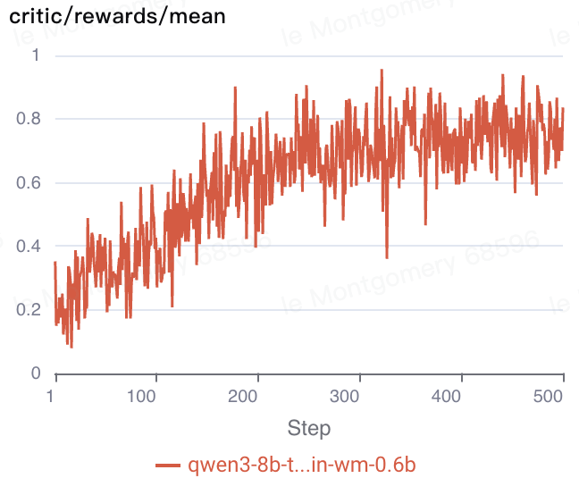
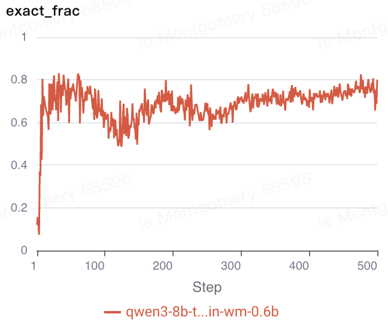

# ObsSpec

This recipe co-trains a policy with GRPO and a world model that predicts tool observations from the same rollouts. The policy speculates ahead while tools execute, retaining speculative generations when predicted and actual observations match exactly.

## Required `verl` version

This recipe is pinned to `verl` commit `6208bc63bd` from the [verl fork](https://github.com/kylemontgomery1/verl), which includes world-model co-training and speculative rollout support; see [`REQUIRED_VERL.txt`](REQUIRED_VERL.txt) for installation details.

## Data

Prepare Endless Terminals from the verl root:

```bash
python3 recipe/obsspec/prepare_data.py
```

The script writes training and validation parquets under `~/data/terminal_obsspec`.

## Training

Install either Modal or Daytona and set the required credentials:

```bash
# Modal (default)
uv pip install modal
export MODAL_TOKEN_ID="<token-id>"
export MODAL_TOKEN_SECRET="<token-secret>"

# Or Daytona
uv pip install daytona
export DAYTONA_API_KEY="<api-key>"
export SANDBOX_PROVIDER=daytona
```

Run co-training on eight policy GPUs and eight world-model GPUs:

```bash
MODEL_PATH=Qwen/Qwen3-8B WM_MODEL_PATH=Qwen/Qwen3-0.6B \
EXPERIMENT_NAME=obsspec-policy-qwen3-8b-wm-qwen3-0.6b \
  bash recipe/obsspec/train.sh
```

The launcher enables speculation during training with depth and breadth of one. Validation uses regular tool execution.

<p align="center">
  
  
</p>

## Reproduction

See [`reproduce/`](reproduce/README.md) for standalone policy training, offline world-model training, and fixed evaluation experiments.
