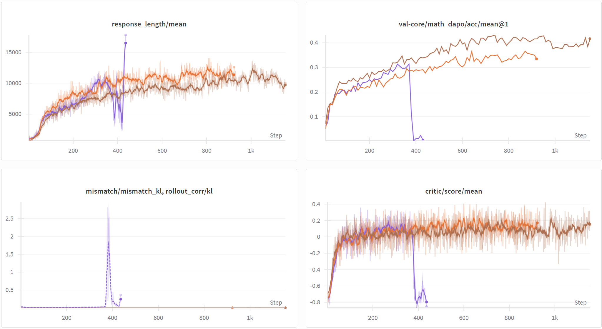
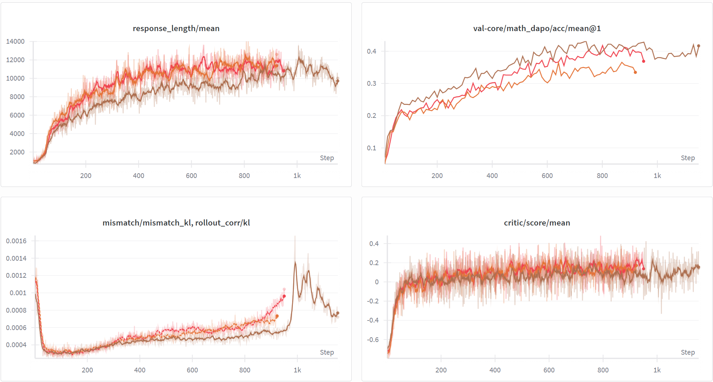
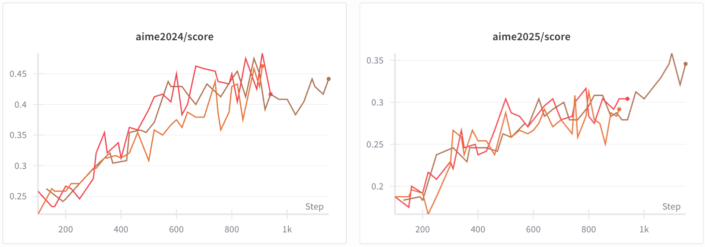
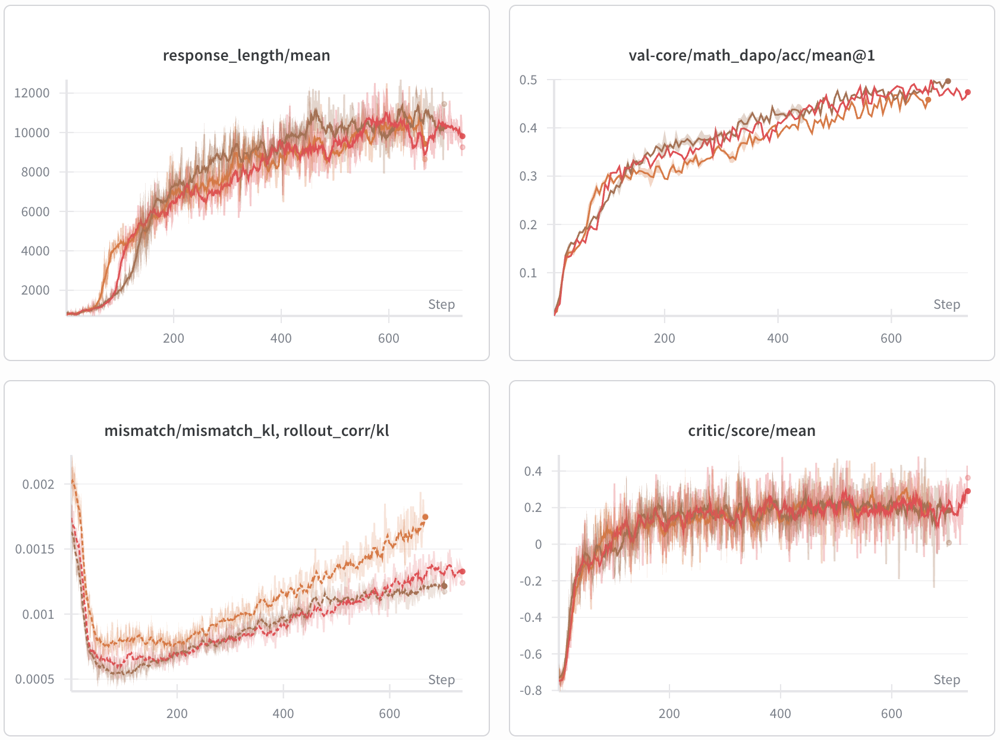
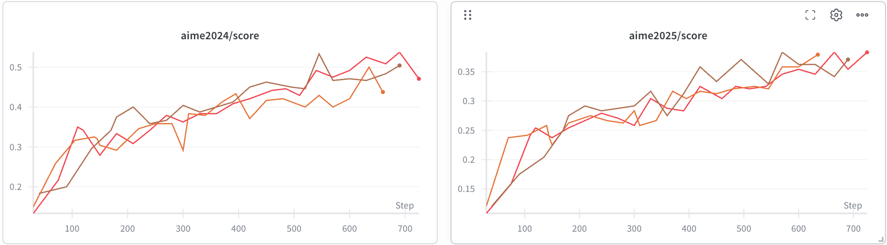
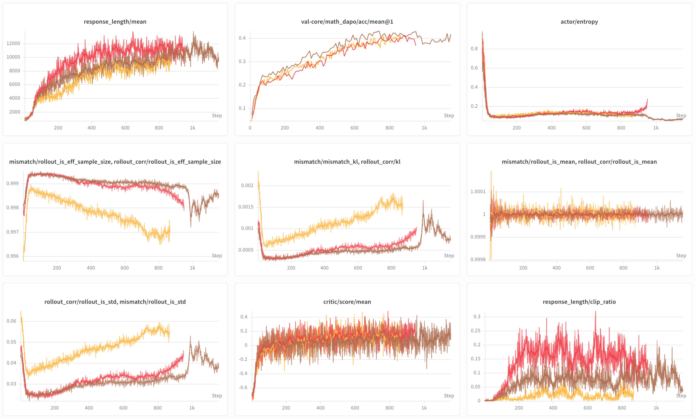

# NVFP4 QAT (Quantization-Aware Training)

## Required `verl` version

See [`REQUIRED_VERL.txt`](REQUIRED_VERL.txt) for the upstream repository, install mode (rolling `main`, pinned release tag, or pinned git commit), and copy-pastable `pip` / `git` instructions where they exist.

This module provides **NVFP4 W4A16 Quantization-Aware Training (QAT)** and an experimental **W4A8 numerical simulation** for low-precision vLLM rollout during training.

W4A16 supports **FSDP** and **Megatron**. The W4A8 simulation is currently limited to **FSDP**, with dense models and the supported vLLM Marlin MoE path covered.

> [!WARNING]
> W4A8 does not execute a native W4A8 kernel. Training fake-quantizes weights to FP4 and activations to blockwise FP8 E4M3. During vLLM rollout, weights still use the W4A16 `compressed-tensors` format and Marlin kernel. FP8 quantize-dequantize is applied to dense Linear inputs and to both expert GEMM inputs in supported fused MoE layers. This validates numerical behavior and training stability only; it does not demonstrate W4A8 latency, throughput, or memory improvements.

---

## Data Preparation

QAT Recipe reuses the DAPO dataset. Download the data before running:

```bash
bash recipe/dapo/prepare_dapo_data.sh
```

---

## FSDP Backend

### Environment

```bash
# Docker image
docker pull vllm/vllm-openai:v0.15.0

# Install verl dependencies inside the container
pip install codetiming pylatexenc pybind11 dill tensorboard pandas accelerate wandb hydra-core peft torchdata tensordict datasets
pip install flash-attn --no-build-isolation --no-cache-dir
```

### Quick Start

**Qwen3-30B-A3B-Base W4A16 Full Quantization**:

```bash
bash recipe/qat/run_qwen3_30b_w4a16.sh
```

**Qwen3-30B-A3B-Base W4A16 FFN-only Quantization**:

```bash
bash recipe/qat/run_qwen3_30b_w4a16_FFN_only.sh
```

**Qwen3-30B-A3B-Base W4A8 Simulation (FFN-only Quantization)**:

```bash
bash recipe/qat/run_qwen3_30b_w4a8_FFN_only.sh
```

### Configuration

Configured under `actor_rollout_ref.actor.fsdp_config.qat`:

| Parameter | Description | Default |
|-----------|-------------|---------|
| `fsdp_config.qat.enable` | Enable QAT | `False` |
| `fsdp_config.qat.mode` | Quantization mode; use experimental `"w4a8"` for W4A8 simulation | `"w4a16"` |
| `fsdp_config.qat.group_size` | Quantization group size | `16` |
| `fsdp_config.qat.ignore_patterns` | Layers to skip. Supports `re:` prefix for regex, otherwise substring match | `["lm_head", "embed_tokens", "re:.*mlp.gate$"]` |
| `fsdp_config.qat.quantization_config_path` | vLLM quantization config JSON path | `recipe/qat/config/nvfp4_w4a16.json` |

**YAML example (Full Quantization)**:

```yaml
actor_rollout_ref:
  actor:
    fsdp_config:
      qat:
        enable: true
        mode: "w4a16"
        group_size: 16
        ignore_patterns:
          - "lm_head"
          - "embed_tokens"
          - "re:.*mlp.gate$"
        quantization_config_path: "recipe/qat/config/nvfp4_w4a16.json"
```

**YAML example (FFN-only Quantization)**:

```yaml
actor_rollout_ref:
  actor:
    fsdp_config:
      qat:
        enable: true
        mode: "w4a16"
        group_size: 16
        ignore_patterns:
          - "lm_head"
          - "embed_tokens"
          - "re:.*mlp.gate$"
          - "re:.*self_attn.*"
        quantization_config_path: "recipe/qat/config/nvfp4_w4a16.json"
```

**YAML example (W4A8 Simulation)**:

```yaml
actor_rollout_ref:
  actor:
    fsdp_config:
      qat:
        enable: true
        mode: "w4a8"
        group_size: 16
        ignore_patterns:
          - "lm_head"
          - "embed_tokens"
          - "re:.*mlp.gate$"
        # Intentional: rollout weights still use the W4A16 NVFP4 format.
        quantization_config_path: "recipe/qat/config/nvfp4_w4a16.json"
```

W4A8 activations use dynamic per-token FP8 E4M3 blocks of shape `1 x 128`. No activation scale is persisted or sent during weight synchronization. With the W4A16 `compressed-tensors` configuration above, setting `mode: "w4a8"` enables the matching activation simulation in vLLM subprocesses. For fused MoE, this covers both the first expert projection input and the down-projection input after the activation function.

---

## Megatron Backend

### Environment

```bash
# Docker image
docker pull verlai/verl:vllm012.latest

# Megatron-Bridge needs to be installed manually inside the container
pip install --no-deps git+https://github.com/NVIDIA-NeMo/Megatron-Bridge@e940d997d7bdb7810f621f5b32bf70255b5aa2d9
```

### Quick Start

**Qwen3-30B-A3B-Base W4A16 Full Quantization**:

```bash
bash recipe/qat/run_qwen3_30b_w4a16_megatron.sh
```

**Qwen3-30B-A3B-Base W4A16 FFN-only Quantization**:

```bash
bash recipe/qat/run_qwen3_30b_w4a16_megatron_FFN_only.sh
```

### Configuration

Configured under `actor_rollout_ref.actor.megatron.qat`. The parameters are the same as FSDP, with the following differences:

- `ignore_patterns` uses **fnmatch** glob syntax (e.g., `*mlp.gate`) instead of `re:` regex (e.g., `re:.*mlp.gate$`)
- Uses `nvfp4_w4a16_megatron.json` (quant_method: `modelopt`) instead of `nvfp4_w4a16.json` (quant_method: `compressed-tensors`)

| Parameter | Description | Default |
|-----------|-------------|---------|
| `megatron.qat.enable` | Enable QAT | `False` |
| `megatron.qat.mode` | Quantization mode | `"w4a16"` |
| `megatron.qat.group_size` | Quantization group size | `16` |
| `megatron.qat.ignore_patterns` | Layers to skip. Uses `fnmatch` (shell glob patterns) | `["lm_head", "*mlp.gate"]` |
| `megatron.qat.quantization_config_path` | vLLM quantization config JSON path | `recipe/qat/config/nvfp4_w4a16_megatron.json` |

**YAML example**:

```yaml
actor_rollout_ref:
  actor:
    megatron:
      qat:
        enable: true
        mode: "w4a16"
        group_size: 16
        ignore_patterns:
          - "lm_head"
          - "*mlp.gate"
        quantization_config_path: "recipe/qat/config/nvfp4_w4a16_megatron.json"
```

---

## Implementation Overview

QAT keeps weights in **BF16 during training** while injecting fake quantization noise (quantize then dequantize) in the forward pass, so the model learns to tolerate quantization error. Gradients pass through the non-differentiable quantization step via Straight-Through Estimator (STE). At **rollout time**, weights are packed into real NVFP4 format and loaded into vLLM for low-precision inference. This closes the precision gap between training and inference, preventing KL divergence explosion.

```
┌──────────────────────────────┐      ┌──────────────────────────────┐
│       Training (BF16)        │      │      Rollout (NVFP4)         │
├──────────────────────────────┤      ├──────────────────────────────┤
│ 1. forward: fake quantize    │      │ 1. Gather full params        │
│    (weight → FP4 → BF16)    │      │ 2. Pack weights to NVFP4     │
│ 2. backward: STE             │  ──► │ 3. Load into vLLM            │
│ 3. optimizer.step() on BF16  │      │ 4. Inference (Marlin kernel) │
└──────────────────────────────┘      └──────────────────────────────┘
```

| | FSDP | Megatron |
|---|---|---|
| Fake Quantization | Custom QATLinear + Triton kernels | NVIDIA ModelOpt |
| Weight Packing | `compressed-tensors` | `modelopt` |
| Code | `verl/utils/qat/` | `verl/utils/modelopt/` |

---

## Experimental Results

The existing W4A16 experiments below were conducted on B300. The W4A8 result focuses on numerical behavior and training stability rather than kernel performance.

### Experiment 1: Qwen3-8B-Base QAT Comparison

Comparing W4A16 quantized training with and without QAT:

| Config | Description | Color |
|--------|-------------|-------|
| BF16 | Baseline, full precision training | Brown |
| W4A16 (no QAT) | Directly quantize BF16 weights and send to vLLM | Purple |
| W4A16 + QAT | Use Fake Quantization during training | Orange |

**Conclusions**:
- Without QAT, `rollout_corr/kl` is two orders of magnitude higher than BF16, grows rapidly during training, and eventually crashes
- With QAT, KL divergence remains consistent with BF16



### Experiment 2: Qwen3-8B-Base Quantization Strategy Comparison

Comparing different quantization strategies:

| Config | Description | Color |
|--------|-------------|-------|
| BF16 | Baseline | Brown |
| W4A16 + QAT (Full) | Full quantization | Orange |
| W4A16 + QAT (FFN-only) | FFN-only quantization | Red |

**Conclusions**:
- Online evaluation (first figure): During training, each configuration uses its own rollout precision (BF16 rollout for BF16, W4A16 rollout for W4A16), so the online metrics are not directly comparable across precisions. Under this setting, BF16 > FFN-only(W4A16) > Full(W4A16).
- Offline evaluation (second figure, AIME24/25): When all trained checkpoints are evaluated uniformly using BF16 precision, all three configurations achieve similar accuracy, indicating that QAT training does not degrade the model's inherent capability.




### Experiment 3: Qwen3-30B-A3B-Base QAT Validation

Validating QAT effectiveness on larger models. Results are consistent with the 8B experiments.

| Config | Color |
|--------|-------|
| BF16 | Brown |
| W4A16 + QAT (Full) | Orange |
| W4A16 + QAT (FFN-only) | Red |




**Memory Analysis**

Analyzed memory impact of NVFP4 during Rollout phase for Qwen3-30B-A3B-Base.

Config: vLLM rollout settings with `gpu_memory_utilization=0.90`, `max_num_batched_tokens=32768`, `max_num_seqs=256`, `TP=1`.

| Metric | BF16 | W4A16 + QAT (Full) | Change |
|--------|------|---------------------|--------|
| Weight | 56.88 GiB | 16.89 GiB | -39.99 GiB (↓70.3%) |
| KV Cache | 181.26 GiB | 221.26 GiB | +40.00 GiB (↑22.1%) |
| Peak Activation | 2.64 GiB | 2.64 GiB | - |
| Non-torch Memory | 0.14 GiB | 0.14 GiB | - |
| CUDAGraph Memory | -1.34 GiB | -1.16 GiB | +0.18 GiB |

**Conclusion**: NVFP4 W4A16 reduces weight memory by **70.3%** (from 56.88 GiB to 16.89 GiB), freeing up ~40 GiB for additional KV Cache capacity.

### Experiment 4: Qwen3-8B-Base W4A8 Numerical Simulation

This experiment compares the FSDP W4A8 FFN-only simulation with its BF16 and W4A16 FFN-only baselines.

| Config | Color |
|--------|-------|
| BF16 | Brown |
| W4A16 + QAT (FFN-only) | Red |
| W4A8 + QAT simulation (FFN-only) | Yellow |

**Configuration**:

- Model: Qwen3-8B-Base.
- Rollout: activations are fake-quantized to FP8 E4M3 with `1 x 128` per-block scaling, while the W4A16 Marlin kernel performs the GEMMs. W4A8 is therefore simulated rather than executed by a native kernel.
- All other settings match the W4A4 comparison runs from the same study.

**Observations**:

- W4A8 FFN-only mismatch KL is slightly higher than BF16 or W4A16 FFN-only.
- Despite the higher mismatch, the online AIME24 validation accuracy curve essentially overlaps with W4A16.
- Entropy tracks W4A16 throughout training, with no sign of the collapse observed with W4A4.

Exploratory Qwen3-30B-A3B runs with an earlier partial MoE rollout prototype also showed closely matched accuracy with slightly higher mismatch KL; because that prototype quantized only the first expert-GEMM input, complete two-input MoE accuracy remains to be validated.



---

## Notes

- **FSDP Scalability**: FSDP backend has scalability limitations for very large models (e.g., Qwen-235B). For large-scale training, use the **Megatron backend** instead.
- **W4A4 Mode**: W4A4 logic is included in the code (FSDP only), but currently has KL divergence issues and is not usable.
- **W4A8 Simulation**: W4A8 is experimental and FSDP-only. Dense models and the standard NVFP4 MarlinExperts path apply FP8 quantize-dequantize at GEMM inputs while retaining W4A16 Marlin GEMMs. Other MoE backends are not supported; other rollout engines have not been validated.
