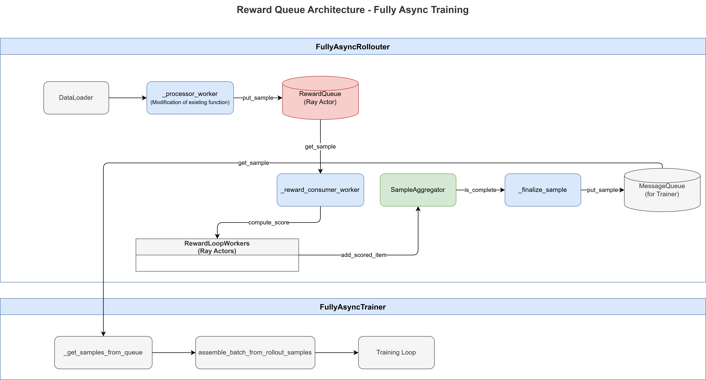
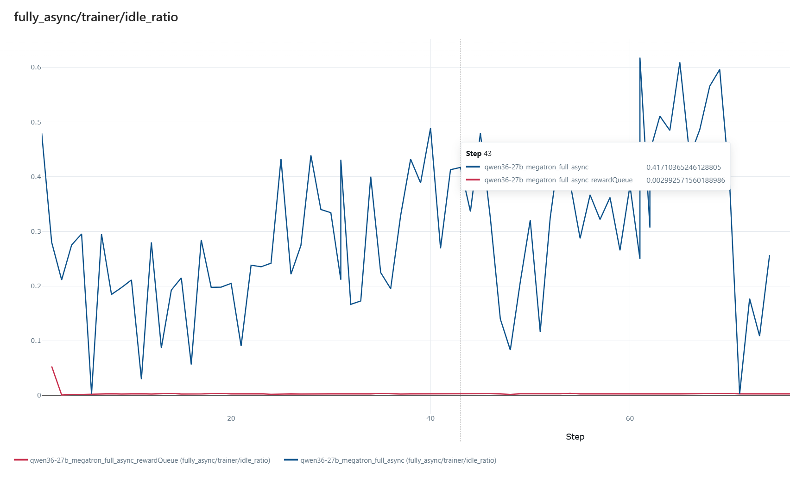

# Reward Queue: Decoupled Inference and Reward Computation

## Required `verl` version

See [`REQUIRED_VERL.txt`](REQUIRED_VERL.txt) for the upstream repository, install mode (rolling `main`, pinned release tag, or pinned git commit), and copy-pastable `pip` / `git` instructions where they exist.

---

## Motivation

In the fully asynchronous training pipeline of VERL (`verl.experimental.fully_async_policy`), inference (generation) and reward computation are traditionally tightly coupled in a sequential pipeline:

```
┌─────────────────────────────────────────────────┐
│  For each Batch:                                │
│       Generation + Reward Computation           │
│            ↓ (Wait for batch completion)        │
│  Training                                       │
└─────────────────────────────────────────────────┘
```

This coupling creates a critical performance bottleneck: when reward computation is slow (e.g., due to external LLM-based judges, complex scoring functions, or network latency), the GPU sits idle waiting for scores to be ready, wasting expensive compute resources.

The **Reward Queue** feature decouples inference from reward computation by introducing an intermediate queue between the two stages, enabling concurrent execution:

```
┌─────────────────┐     ┌──────────────┐     ┌─────────────────┐
│   Generation    │────▶│ RewardQueue  │────▶│ Reward Compute  │
│   (async)       │     │              │     │ (concurrent)    │
└─────────────────┘     └──────────────┘     └─────────────────┘
```

This allows generation and scoring to overlap in time, ideally reducing total time to half of the original, and maximizes GPU utilization and throughput.

---

## Architecture



### Core Pipeline

**Sampling & Inference** — The rollouter continuously feeds batches from the DataLoader. For each batch, sub-items are dispatched for async generation and immediately buffered into the **RewardQueue** without waiting for reward results.

**Reward Computation** — A dedicated consumer worker pulls sub-items from the RewardQueue and distributes them across a pool of reward workers for concurrent scoring. Backpressure is applied when needed to prevent resource exhaustion.

**Aggregation & Training** — Scored sub-items flow back to the aggregator, which assembles complete samples once all sub-items arrive. These are then published to a MessageQueue for the trainer to consume and process.

### Key Components

| Component           | File              | Role                                                         |
| ------------------- | ----------------- | ------------------------------------------------------------ |
| `RewardQueue`       | `reward_queue.py` | Ray actor-based async queue with producer-consumer semantics |
| `SubRewardDataItem` | `utils.py`        | Data item passed through the queue                           |
| `SampleAggregator`  | `utils.py`        | Accumulates scored sub-items per sample                      |
| `Rollouter`         | `rollouter.py`    | Extended FullyAsyncRollouter with reward queue support       |
| `Trainer`           | `trainer.py`      | Extended FullyAsyncTrainer with timing metadata              |

### Key Design Points

- **Temporal decoupling**: Inference output and reward computation run at their own pace via the queue buffer
- **Concurrent scoring**: Multiple reward workers score sub-items in parallel, throttled by a concurrency limit
- **Backpressure control**: The consumer can pause/resume scoring based on system load
- **Clean handoff boundary**: MessageQueue separates rollouter and trainer execution domains

---

## Data Flow

### Phase 1: Sample Feeding

1. `FullyAsyncRollouter._feed_samples()` iterates over the DataLoader
2. Creates `RolloutSample` for each batch and puts into `pending_queue`

### Phase 2: Inference and Queue Production

3. `_processor_worker()` processes samples from `pending_queue`
4. When `enable_reward_queue=True`, calls `_process_sample_with_reward_queue()`:
   - For each sub-item in batch, launches async generation via `generate_single_for_reward_queue()`
   - Creates `SubRewardDataItem` with inference timing metadata
   - Puts into `RewardQueue` via `reward_queue_client.put_sample()`

### Phase 3: Reward Computation (Consumer)

5. `_reward_consumer_worker()` continuously:
   - Checks if scoring should pause (`_should_pause_scoring()`)
   - Gets `SubRewardDataItem` from `reward_queue_client.get_sample()`
   - Submits reward computation via `reward_loop_worker.compute_score.remote()`
   - Limits concurrent reward tasks via `max_concurrent_rewards`

### Phase 4: Aggregation and Finalization

6. `SampleAggregator.add_scored_item()` accumulates scored sub-items
7. When all sub-items for a sample are collected, `_finalize_sample()`:
   - Builds `rm_scores` tensor with scores at the last valid position
   - Adds reward timing metadata to the batch
   - Creates `RolloutSample` and puts into `MessageQueue` (for Trainer)

### Phase 5: Training

8. `FullyAsyncTrainer._get_samples_from_queue()` retrieves samples
9. Calls `assemble_batch_from_rollout_samples()` with `enable_reward_queue=True`
10. Processes reward timing metadata for metrics collection

---

## Quick Start

### Enable the Feature

Set `async_training.enable_reward_queue: true` in your config:

```yaml
async_training:
  enable_reward_queue: true
  reward_queue_size: null  # Uses default: max_required_samples * rollout_n
```

Or via command line:

```bash
python -m recipe.reward_queue.main \
    --config-path=config \
    --config-name='fully_async' \
    async_training.enable_reward_queue=true \
    # ... other config
```

### Run Training

```bash
# Single node (8 GPUs)
NNODES=1 NGPUS_PER_NODE=8 \
MODEL_PATH=Qwen3-8B \
TRAIN_FILE=./gsm8k/train/gsm8k_tra.jsonl \
VAL_FILE=./gsm8k/eval/gsm8k_ev.jsonl \
bash recipe/reward_queue/train_async.sh
```

---

## Configuration

### Async Training Config

| Parameter                            | Default | Description                                                  |
| ------------------------------------ | ------- | ------------------------------------------------------------ |
| `async_training.enable_reward_queue` | `false` | Enable/disable reward queue decoupling                       |
| `async_training.reward_queue_size`   | `null`  | Max queue size. `null` means `max_required_samples * rollout_n` |

Where:

- `max_required_samples = ppo_mini_batch_size * require_batches * (1 + staleness_threshold) * trigger_parameter_sync_step`
- `rollout_n = actor_rollout_ref.rollout.n` (number of responses per prompt)

---

## Monitoring Metrics

| Metric | Description |
|--------|-------------|
| `monitor/queue/reward_queue_size` | Current reward queue size |
| `reward_queue/total_produced` | Total items produced to queue |
| `reward_queue/total_consumed` | Total items consumed from queue |
| `reward_queue/dropped_samples` | Samples dropped due to queue overflow |
| `static/max_reward_queue_size` | Maximum configured queue size |
| `timing_s/reward_compute/mean` | Mean reward computation time |

---

## Use Cases

1. **External LLM Judges**: When reward computation involves calling external LLM APIs (e.g., for LLM-as-a-Judge scoring), network latency can be significant. Reward queue allows generation to continue while waiting for API responses.

2. **Complex Scoring Functions**: Multi-step reward computation pipelines with multiple model calls benefit from overlapping generation with scoring.

3. **Variable Reward Latency**: When reward computation time varies significantly across samples, the queue buffers fast results while waiting for slow ones.

4. **Throughput Optimization**: Maximizing GPU utilization by keeping either generation or scoring always active, even when the other is blocked.

---

## Performance

**Experiment setup** — 64-NPU cluster (8 nodes × 8 NPUs), GRPO, Qwen3.6-27B, Megatron parallelism (TP=4, PP=2, CP=4, 32 NPUs for training), vLLM async rollout. Key hyperparameters:

| Parameter | Value |
|-----------|-------|
| `max_prompt_length` | 8000 |
| `max_response_length` | 8000 |
| `rollout.n` | 8 |
| `ppo_mini_batch_size` | 32 |
| `async_training.require_batches` | 2 |
| Reward function | External LLM judge |

**Trainer idle ratio breakdown** — The chart below visualizes the `fully_async/trainer/idle_ratio` metric over the first ~80 steps for both configurations:



- **Blue line (`enable_reward_queue=false`)**: The idle ratio oscillates wildly between 0 and 0.6, meaning the trainer spends a large fraction of time idle while waiting for reward computation to finish — GPU compute is significantly underutilized.
- **Red line (`enable_reward_queue=true`)**: The idle ratio stays near 0 throughout, confirming that the reward queue keeps generation and scoring overlapping, so the trainer is continuously fed and GPU resources are fully utilized.

This reduction in idle time translates directly to faster training: the average step latency drops from **1772 s** to **1154 s** (~35% faster). With the reward queue enabled, generation and reward computation run concurrently, eliminating the idle gaps caused by waiting for slow reward scoring.
